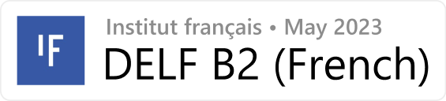

  <h3>An average high school student</h3>
  <h1>👋 Welcome to my profile!</h1>

 

## 🎈 Quick Sum

- 🎂 | Age • 17 (Oct 3rd is my birthday)
- 🏳️ | Country • Turkey
- 💻 | Skills • TypeScript, C#, Lua, Java, PHP
- 🎮 | Games • Genshin Impact, LoL, Minecraft, tbh just check my steam
- 📧 | Discord • sards
- ⛪ | Interests • SynBio, Computer Science
- 🥽 | Favorite Subjects • Biology, Math and Chemistry

## 🧑‍💻 My Work

- Through 2020-2022, I've worked with several Gmod communities-highly Hogwarts role-play servers- where I developed necessary systems (closed-sourced) for them. I wrote these systems majorly in Lua [(Check out GLua API)](https://wiki.facepunch.com/gmod/) and also included C++ and web server development. 
- I also have written Discord Bots for several communities (almost all of them are closed-source, but I recently published my framework publicly [Silica Framework](https://github.com/cborac/Silica-Framework))
- Projects like [Runes++](https://github.com/cborac/Runes-plus-plus), [AirPods Connect](https://github.com/cborac/AirPods-Connect), were primarily experimental and short-term projects, which I don't plan to continue development unless I am bored.
- I also have worked on several closed-source projects, which I cannot disclose here.
- I am also an iGEMer, I am a part of my school's team since Sept 2019; but only in 2021 we participated. However, we are participating this year too!
  - **[🥈 Cellulophile (2021)](https://2021.igem.org/Team:Saint_Joseph)**: enchanced cellulases to fight against paper pollution: 

For further details, check out [my website](https://boraciner-is.me)-which is *extremely* plain.

## 🪶 More About Me

- 🎨 | I am currently trying out new technologies for fun. [(See the board)](https://cbora.notion.site/2d61574b2acd466593d3935bf3120574?v=8a8c6f2edc774f3297b151e868404339)
- ⭐ | My MBTI is **INFP-T** also my ennegram personality alignment is **5w4**.
- ♎ | My star sign is **Libra**. (Fun fact: I used to be really into astrology but after a quote my beliefs have shifted)
- I really like these fictions:
  - 🌸 | Steven Universe is my favorite TV series since 2014 and it had a great impact on me.
  - 🍂 | I've met with Heartstopper when its Netflix series was first announced, I've read the novels and continued to read Alice Oseman's work-which are truely incredible.
  - 🤖 | Neon Genesis Evangelion is my favorite anime; personally, I prefer the rebuild series.
  - 🔥 | I'm a fan of Marvel Cinematic Universe, also my favorite character is probably Wanda.

  

## 🪪 Licences and Certifications

  
  
  
  
  
  
  
  
   
  
   
  
  

 
 

